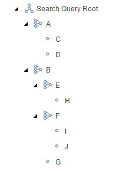

# Nested Search Queries

In the [basics](../basics/ConfigureSearchQuery.md#configuring-the-search-query) section, we created a simply search query root containing a few search query rules. In the following, you'll see how Conjunction can configure even more complex search query structures, consisting of nested search queries in varies ways. 

## Creating a Nested Search Query Structure

In this example, we'll be creating a small nested search query structure, and explain how the structure gets evaluated.

As described in the [basics](../basics/ConfigureSearchQuery.md#configuring-the-search-query) section, start with creating a new search query root item. Once created, perform the following steps:

1. From the search query root item, create a new Search Query Grouping item, named *A* with the logical operator set to *AND*
2. From the new search query grouping item, create two new Search Query Rule items, named *C* and *D*
3. From the search query root item, create a new Search Query Grouping item, named *B* with the logical operator set to *OR* 
4. From the new search query grouping item, create two new Search Query Grouping items, named *E* with the logical operator set to *AND* and *F* with the logical operator set to *AND*, and a new Search Query Rule item, named *G*
5. Inside the newly created search query grouping, create a new Search Query Rule item, named *H* for the first search query grouping and two named *I* and *J* for the second search query grouping

If you've follows the steps, you should now have a search query item structure that looks similar to this:

  

Looking at the search query configuration from the top, we have that:

``A AND B``

This can be expanded into the following:

``(C AND D) AND (E OR F OR G)``

Which can be expanded even further into:

``C AND D AND (H OR (I AND J) OR G)``

where ``C``, ``D``, ``H``, ``I``, ``J`` and ``G`` would be concrete examples of search query rules.

> **Note**: When more than one logical operator is used in a query, AND is evaluated first, then OR. The meaning of the query is changed by adding parentheses to force evaluation of the OR first, which is controlled by the search query groupings.

As you can see, there are no limits to how a search query can be structured in terms of having a complex nested structure.