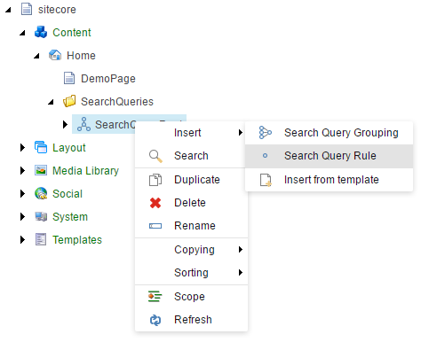

# Configuring the Search Query

With the custom ``ToyBall`` indexable model in place, the next step is to configure the search query elements inside Sitecore.

## Creating the Search Query Root

Navigate over to the Content Editor in your Sitecore solution and create a new *search query root* item by right-clicking anywhere in the content tree, select the insert option and click *Insert from template*. From here, open the folder */Conjunction/Foundation*, and from here select the template named **Search Query Root**:

When the template has been selected, enter a given name and click on the *Insert* button to create the search query root item. Once you have created the search query root item, select it in the content tree in order to edit its fields:

By default, the search query root item has two fields that needs to be configured, the **configured indexable entity type** and the **logical operator**. The configured indexable entity type is used to specify the indexable entity model being used when configuring search query rules. Set the name of the configured indexable entity type to be the fully qualified name of the ``ToyBall`` type we just created in the previous step - in this example, the assembly containing the ``ToyBall`` type reside in the assembly ``Demo`` under the namespace ``Demo.Model``, your fully qualified name may vary depending on your assembly name. 

In addition, the logicial operator field defines the logical relationship between the child search query elements. For now, simply set it to *And*, meaning that the overall search query will use a logical *AND* operator to determine the logical relationship between the individual search queries from its child search query elements.

## Creating a set of Search Query Rules

With the search query root configured, the next step is to create a few **Search Query Rule** items. In this example, we'll be creating two search query rules that each demonstrates the different kind of configuration you can use. 

### Rule #1: Make sure we only get results from a specific date

The first search query rule we are going to create will be named *WhereCreatedDateIsGreaterThanOrEqual*. In order to do so, right-click the newly created search query root item, select the insert option and select *Search Query Rule*:

with the following field configuration:

Taking it from the top, the first field *Associated Property Name* ties the search query rule together with a given property that is defined on the indexable entity model specified on the search query root item. 

> **Note**: You can only select associated properties that exists on the configured indexable entity type, which is defined on the search query root item. 

The next field *Comparison Operator* specifies how the associated property should be compared (using binary operators) to a given value that can either be dynamic or static. Using a dynamic value, we need to specify the name of the dynamic value we want to retrieve using the *Dynamic Value Providing Parameter* field, whereas we simply need to provide the raw value when the default value using the *Default Value* field. 

If we look at this perticular rule as a whole it says that the associated property ``CreatedDate`` should be *greater than or equal* to a given default value of the 1st of January in year one. While not the most intriguing search query rule, this search query rule demonstrates how we can utilize default values for feeding in static configuration to our search query definitions. 

> **Tip**: Another concrete example of using statically defined default values, would be to constraint the search result query to include include (or exclude) items of a specific Sitecore data template.

### Rule #2: Only include results named...

The second search query rule we will be creating will be named *WhereNameEquals*, which has the following field configuration:

Like the first search query rule we defined, this search query rule is set to use the property ``Name`` of the defined indexable entity model, which should be *equal* to the value being dynamically delivered by the dynamic value providing parameter, named ``$x``. 

In contrary to using the default value, as we saw in the first search query rule, this search query rule will react to changes to values being provided by the parameter ``$x``, and swap in the value it finds for that parameter in runtime, before making the actual comparison. This technique is usable for feeding in informations that requires involment of dynamic sources, such as the end-user providing the name of the indexable entity model.

## Next steps

Next, we'll look into how you can execute a query to the underlying search engine, using the configured search query from Sitecore together with the Conjunction's API.